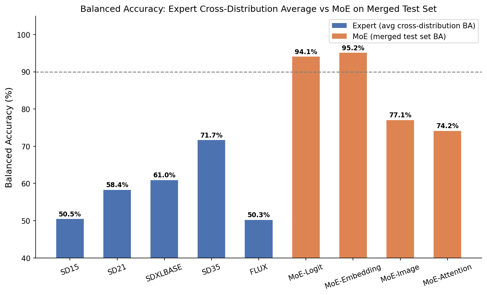
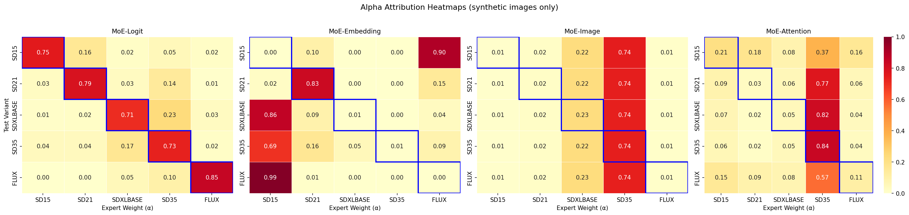
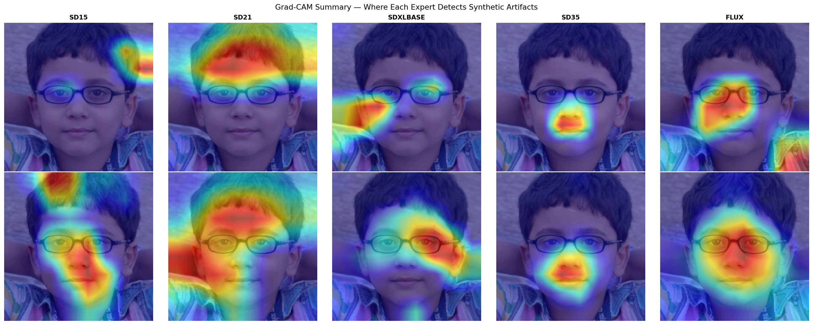
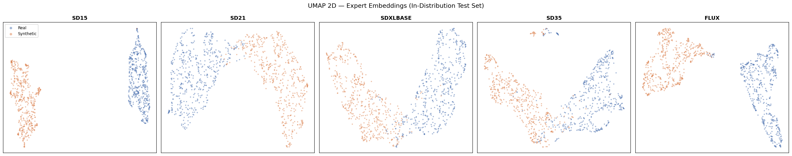

# Unmasking Synthetic Images

> Mixture of Experts framework for forensic detection and attribution of AI-generated images across 5 Stable Diffusion variants.


[](https://huggingface.co/datasets/enricoroncuzzi/unmasking-synthetic-images-dataset)
[](https://huggingface.co/enricoroncuzzi/unmasking-synthetic-images-models)

---

## Problem

AI-generated images leave statistical fingerprints in their pixel structure. A detector trained on one generative model (e.g. SD 1.5) fails completely when tested on another (e.g. FLUX) — cross-distribution balanced accuracy drops to ~50%, equivalent to a random classifier.

This project builds a **Mixture of Experts** system that solves this: 5 specialized ResNet50 detectors, each expert in one SD variant, combined by a trainable gating network that routes each input to the right specialist. The result is a system that generalizes across all 5 variants simultaneously, recovering the ~45 percentage-point accuracy gap that single experts cannot bridge.

---

## Architecture

```
Input image (3×256×256)
        │
        ▼
┌────────────────────────────────────────┐
│  5 Expert ResNet50  (FROZEN)           │
│  SD1.5 │ SD2.1 │ SDXL │ SD3.5 │ FLUX  │
│  → logits [B,2] + embeddings [B,2048]  │
└────────────────────────────────────────┘
        │
        ▼
┌──────────────────────┐
│   Gating Network     │  ← trainable only
│   (4 strategies)     │
└──────────────────────┘
        │
        ▼
   alphas [B,5]  +  final_logits [B,2]
```

| Strategy | Input | Trainable Params | Test AUC | Test BA |
|---|---|---|---|---|
| **Logit** | Expert logits (5×2) | ~1K | **0.986** | 94.1% |
| **Embedding** | Expert embeddings (5×2048) | ~10.5M | 0.985 | **95.2%** |
| Image | Raw input patch | ~20K | 0.913 | 77.1% |
| Attention | Expert logit tokens (5×2) | ~300 | 0.891 | 74.2% |

All experts run concurrently on separate CUDA streams. Only the gating network is trained (Phase 3). Expert weights are permanently frozen after Phase 2.

---

## Results

### Individual experts — in-distribution vs cross-distribution

| Expert | In-Dist AUC | In-Dist BA | Cross-Dist BA (avg) |
|---|---|---|---|
| ResNet50-SD15 | 1.000 | 99.8% | ~50% |
| ResNet50-SD21 | 0.999 | 98.0% | ~50% |
| ResNet50-SDXL | 0.987 | 93.9% | ~61% |
| ResNet50-SD35 | 0.985 | 92.2% | ~69% |
| ResNet50-FLUX | 1.000 | 99.3% | ~50% |

Every expert is near-perfect on its own variant, near-random on all others. SD3.5 is the most generalizing expert — its hybrid architecture captures artifacts that partially transfer across variants. This specialization is the core motivation for the MoE approach.

### MoE vs individual experts — the generalization gap



Individual experts average ~50–69% balanced accuracy outside their training distribution. All four MoE strategies exceed 90% BA on the same cross-distribution scenario — a **~40 percentage-point recovery** from the specialization failure.

### MoE strategies — full test set metrics

| Strategy | AUC | Balanced Acc | Precision | Recall | F1 |
|---|---|---|---|---|---|
| MoE-Logit | 0.986 | 94.1% | 0.941 | 0.942 | 0.941 |
| MoE-Embedding | 0.985 | 95.2% | 0.947 | 0.957 | 0.952 |
| MoE-Image | 0.913 | 77.1% | 0.952 | 0.572 | 0.714 |
| MoE-Attention | 0.891 | 74.2% | 0.923 | 0.528 | 0.672 |

**MoE-Logit** achieves near-identical detection to MoE-Embedding (~1K vs ~10.5M parameters) and is the only strategy that also produces correct **attribution**: the gating assigns the highest alpha weight to the specialist expert that matches each input's generative source.

### Attribution — gating weight analysis



MoE-Logit (leftmost) shows a clear diagonal: SD1.5 inputs route to the SD1.5 expert, SD2.1 to the SD2.1 expert, and so on. MoE-Embedding collapses to a two-expert routing strategy, trading attribution for +1% BA. Image and Attention strategies converge to the single most generalizing expert (SD3.5) regardless of input source.

---

## Visualizations

### Grad-CAM — where experts detect synthetic artifacts



Grad-CAM activations on `layer4[-1]` of each ResNet50 expert (target class: synthetic). Activations concentrate on facial regions where the VAE roundtrip at `strength=0.05` introduces sub-pixel statistical deviations — the primary carrier of forensic fingerprints in portrait images.

### UMAP — embedding space structure



Each expert learns a well-separated 2D embedding space for its own variant (Real vs Synthetic clusters). When the most generalizing expert (SD3.5) is run on all 5 SD variants simultaneously, the six classes form a single mixed manifold — the expert can detect real vs synthetic, but cannot separate generative sources. This geometric confirmation explains why attribution requires the MoE routing mechanism.

---

## Dataset

**6000 images** — 1000 real (OpenImages) + 1000 per SD variant, generated via img2img at `strength=0.05` (VAE roundtrip + minimal denoising, visually identical to the original, forensic fingerprint intact).

| Variant | Resolution | Generator |
|---|---|---|
| SD 1.5 | 512px | `runwayml/stable-diffusion-v1-5` |
| SD 2.1 | 768px | `stabilityai/stable-diffusion-2-1` |
| SDXL Base | 1024px | `stabilityai/stable-diffusion-xl-base-1.0` |
| SD 3.5 Medium | 512px | `stabilityai/stable-diffusion-3.5-medium` |
| FLUX.1-schnell | 768px | `black-forest-labs/FLUX.1-schnell` |

Available on HuggingFace: [enricoroncuzzi/unmasking-synthetic-images-dataset](https://huggingface.co/datasets/enricoroncuzzi/unmasking-synthetic-images-dataset)

---

## Stack

| Area | Tools |
|---|---|
| Deep Learning | PyTorch, PyTorch Lightning |
| Computer Vision | torchvision (ResNet50), pytorch-grad-cam |
| Experiment Tracking | MLflow |
| Config Management | Hydra |
| Visualization | matplotlib, seaborn, UMAP |
| Data | HuggingFace Datasets, diffusers |
| Cloud | RunPod A40 48GB (dataset generation), Kaggle T4 (evaluation) |

---

## Project Structure

```
data/            dataset pipeline, manifests, Albumentations transforms
models/          ExpertModel (ResNet50), MoEModel, 4 gating strategies
training/        Lightning training scripts — train_expert.py, train_moe.py
evaluation/      evaluate_expert.py, evaluate_moe.py, gradcam.py, umap_viz.py
configs/         Hydra configs — expert × 5, moe × 4
results/         analysis.ipynb + evaluation plots per run (t8–t11)
scripts/         train_all_experts.sh, train_all_moe.sh
checkpoints/     experts/ + moe/ — best checkpoints per variant/strategy
```

Pretrained checkpoints: [enricoroncuzzi/unmasking-synthetic-images-models](https://huggingface.co/enricoroncuzzi/unmasking-synthetic-images-models)

---

## Medium Articles

- [Part 1 — Building a Forensic AI Dataset Across 5 Stable Diffusion Variants](https://medium.com/@enricoroncuzzi/part-1-building-a-forensic-ai-dataset-across-5-stable-diffusion-variants-sd1-5-to-flux-dfd39f5b50d1)
- [Part 2 — Training Five Specialized Detectors on a Forensic Image Dataset](https://medium.com/@enricoroncuzzi/phase-2-training-five-specialized-detectors-on-a-forensic-image-dataset-267f59841940)

---

## Reproduce

```bash
pip install -r requirements.txt

# Download dataset from HuggingFace
python data/download_dataset.py --token YOUR_HF_TOKEN --workers 1

# Generate train/val/test manifests
python data/prepare_manifests.py

# Train all 5 experts sequentially
bash scripts/train_all_experts.sh

# Train all 4 MoE gating strategies (requires expert checkpoints)
bash scripts/train_all_moe.sh

# Run evaluation suite (Phase 4)
python evaluation/evaluate_expert.py
python evaluation/evaluate_moe.py
python evaluation/gradcam.py
python evaluation/umap_viz.py
```

Expert checkpoints are resolved via glob patterns (`checkpoints/experts/<name>/best-*.ckpt`) — filename changes between runs are handled automatically. Pretrained weights available on HuggingFace if you want to skip training.

---

## Roadmap

- [x] Phase 1 — Forensic dataset generation (6000 images, 5 SD variants, HuggingFace)
- [x] Phase 2 — ResNet50 expert training (AUC 0.985–1.000 in-distribution)
- [x] Phase 3 — Mixture of Experts with 4 gating strategies (ablation study)
- [x] Phase 4 — Evaluation suite: ROC curves, Grad-CAM, UMAP, attribution analysis
- [ ] Phase 5 — Gradio demo on HuggingFace Spaces
- [ ] Phase 6 — Docker, pytest, packaging
