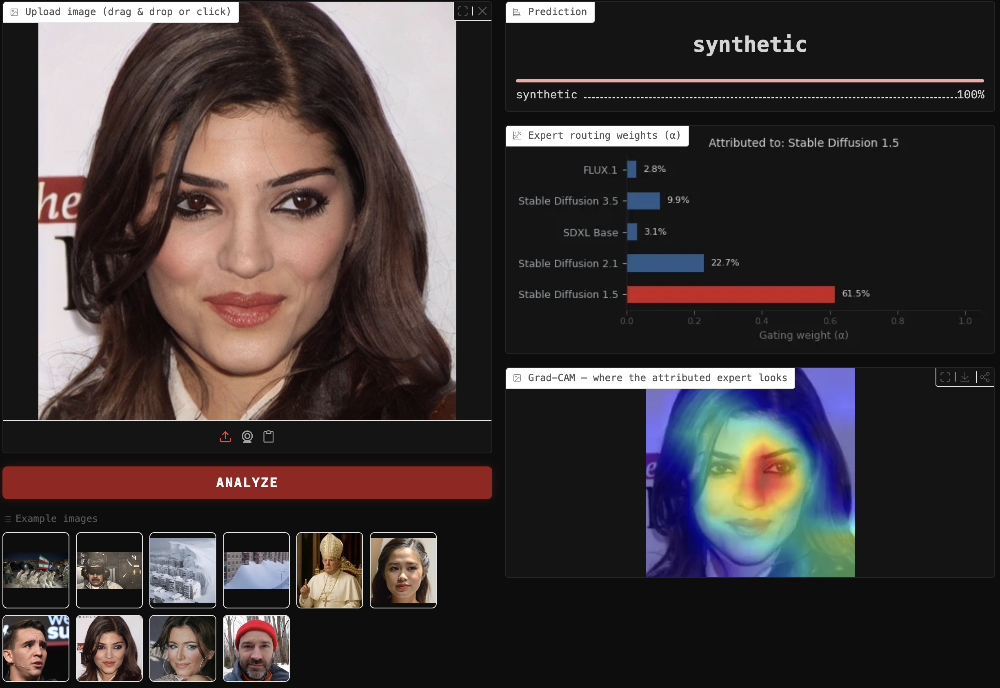
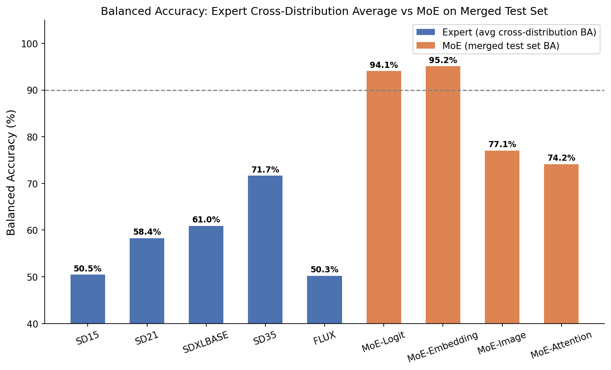
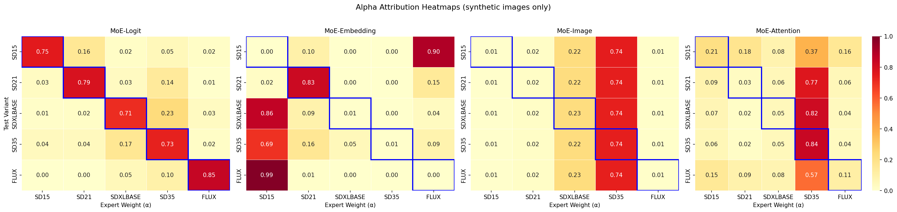
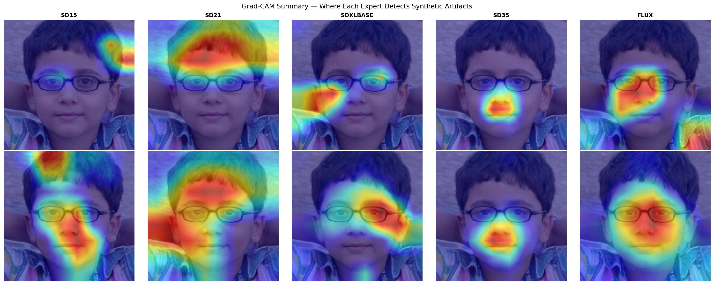
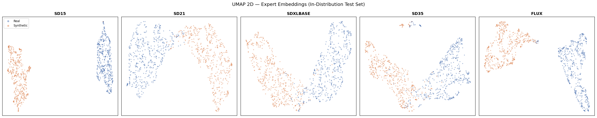
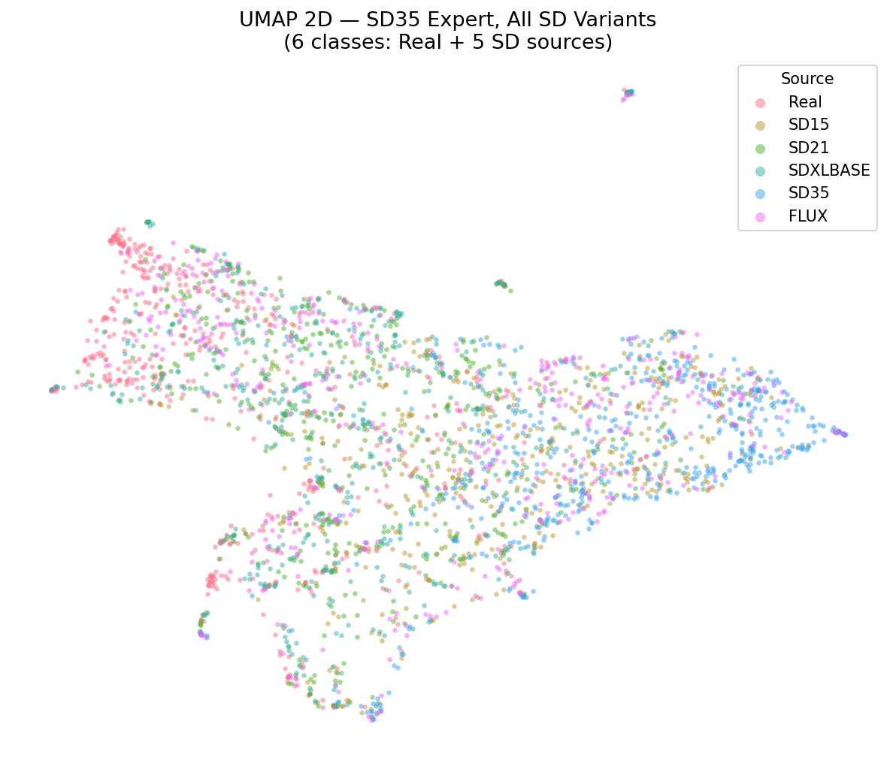

[](https://huggingface.co/spaces/enricoroncuzzi/unmasking-synthetic-images-demo)
[](https://github.com/enricoroncuzzi/unmasking-synthetic-images/actions/workflows/ci.yml)

# Unmasking Synthetic Images

> Mixture of Experts framework for forensic detection and attribution of AI-generated images across 5 Stable Diffusion variants.

[](https://huggingface.co/spaces/enricoroncuzzi/unmasking-synthetic-images-demo)

## Try it live

Upload any image at the [HuggingFace Space](https://huggingface.co/spaces/enricoroncuzzi/unmasking-synthetic-images-demo) — no setup required.

---


[](https://huggingface.co/enricoroncuzzi/unmasking-synthetic-images-models)

---

## Problem

Drop in any image and find out whether it's real or AI-generated — and if it's fake, which model made it.

Every generative model leaves a different statistical fingerprint in its pixel output, so a detector trained on Stable Diffusion 1.5 falls apart the moment you show it FLUX. Cross-distribution balanced accuracy drops to around 50%. Basically a coin flip.

A Mixture of Experts solves this. Five ResNet50 detectors, each specialized in a single Stable Diffusion variant, plus a small gating network that learns to route every input to the right specialist. Together they hit 94.1% balanced accuracy across SD 1.5, SD 2.1, SDXL, SD 3.5 and FLUX, about 45 points more than any single expert can manage on its own.

In the demo, the bar chart tells you which generator's fingerprint dominated, and the Grad-CAM heatmap shows where the chosen expert was looking when it made the call.

---

## Architecture

```
Input image (3×256×256)
        │
        ▼
┌────────────────────────────────────────┐
│  5 Expert ResNet50  (FROZEN)           │
│  SD1.5 │ SD2.1 │ SDXL │ SD3.5 │ FLUX  │
│  → logits [B,2] + embeddings [B,2048]  │
└────────────────────────────────────────┘
        │
        ▼
┌──────────────────────┐
│   Gating Network     │  ← trainable only
│   (4 strategies)     │
└──────────────────────┘
        │
        ▼
   alphas [B,5]  +  final_logits [B,2]
```

| Strategy | Input | Trainable Params | Test AUC | Test BA |
|---|---|---|---|---|
| **Logit** | Expert logits (5×2) | ~1K | **0.986** | 94.1% |
| **Embedding** | Expert embeddings (5×2048) | ~10.8M | 0.985 | **95.2%** |
| Image | Raw input patch | ~22K | 0.913 | 77.1% |
| Attention | Expert logit tokens (5×2) | ~40 | 0.891 | 74.2% |

All experts run concurrently on separate CUDA streams. Only the gating network is trained (Phase 3). Expert weights are permanently frozen after Phase 2.

---

## Results

### Individual experts — in-distribution vs cross-distribution

| Expert | In-Dist AUC | In-Dist BA | Cross-Dist BA (avg) |
|---|---|---|---|
| ResNet50-SD15 | 1.000 | 99.8% | ~50% |
| ResNet50-SD21 | 0.999 | 98.0% | ~58% |
| ResNet50-SDXL | 0.987 | 93.9% | ~61% |
| ResNet50-SD35 | 0.985 | 92.2% | ~72% |
| ResNet50-FLUX | 1.000 | 99.3% | ~50% |

SD1.5 and FLUX are highly specialized: near-perfect on their own variant, near-random on the others. SDXL and SD2.1 transfer partially. SD3.5 is the most generalizing expert, with cross-distribution BA in the 60s–80s — its hybrid architecture captures artifacts that carry across variants. Either way, no single expert solves the cross-distribution problem on its own, which is what motivates the MoE approach.

### MoE vs individual experts — the generalization gap



Individual experts average 50–72% balanced accuracy outside their training distribution. The two best MoE strategies (Logit and Embedding) push that to 94–95% on the same cross-distribution scenario — a **~45 percentage-point recovery** from the worst-case specialization failure. The Image and Attention strategies trail at 77% and 74%, as the strategies table below shows.

### MoE strategies — full test set metrics

| Strategy | AUC | Balanced Acc | Precision | Recall | F1 |
|---|---|---|---|---|---|
| MoE-Logit | 0.986 | 94.1% | 0.941 | 0.942 | 0.941 |
| MoE-Embedding | 0.985 | 95.2% | 0.947 | 0.957 | 0.952 |
| MoE-Image | 0.913 | 77.1% | 0.952 | 0.572 | 0.714 |
| MoE-Attention | 0.891 | 74.2% | 0.923 | 0.528 | 0.672 |

**MoE-Logit** achieves near-identical detection to MoE-Embedding (~1K vs ~10.8M parameters) and is the only strategy that also produces correct **attribution**: the gating assigns the highest alpha weight to the specialist expert that matches each input's generative source.

### Attribution — gating weight analysis



MoE-Logit (leftmost) shows a clear diagonal: SD1.5 inputs route to the SD1.5 expert, SD2.1 to the SD2.1 expert, and so on. MoE-Embedding loses the diagonal — it routes most inputs to the SD1.5 expert, with the SD2.1 expert preserved as the only in-distribution match — trading attribution for +1% BA. Image and Attention strategies converge to the single most generalizing expert (SD3.5) regardless of input source.

---

## Visualizations

### Grad-CAM — where experts detect synthetic artifacts



Grad-CAM activations on `layer4[-1]` of each ResNet50 expert (target class: synthetic). Activations concentrate on facial regions where the VAE roundtrip at `strength=0.05` introduces sub-pixel statistical deviations — the primary carrier of forensic fingerprints in portrait images.

### UMAP — embedding space structure



Each expert learns a well-separated 2D embedding space for its own variant (Real vs Synthetic clusters).



When the most generalizing expert (SD3.5) is run on all 5 SD variants simultaneously, the six classes form a single mixed manifold — the expert can detect real vs synthetic, but cannot separate generative sources. This geometric confirmation explains why attribution requires the MoE routing mechanism.

---

## Run locally with Docker

```bash
docker compose up --build
```

- Gradio UI: http://localhost:7860
- API docs:  http://localhost:8000/docs

On first start the model checkpoints (~1.9 GB) are downloaded and cached in a Docker volume — subsequent starts are instant.

---

## REST API

```bash
# Health check
curl http://localhost:8000/health

# Predict
curl -X POST http://localhost:8000/predict \
  -F "file=@your_image.jpg"
```

`/health` response:

```json
{"status": "healthy", "model_loaded": true, "strategy": "logit"}
```

`/predict` response:

```json
{
  "prediction": "synthetic",
  "confidence": 0.97,
  "alpha_weights": {"sd15": 0.02, "sd21": 0.01, "sdxlbase": 0.03, "sd35": 0.08, "flux": 0.86},
  "attributed_source": "flux"
}
```

`/predict` accepts JPEG and PNG only (other formats return HTTP 400), max 10 MB per upload (larger returns HTTP 413). When the prediction is `"real"`, `attributed_source` is `null`.

---

## Dataset

**6000 images** — 1000 real + 1000 per SD variant, generated via img2img at `strength=0.05` (VAE roundtrip + minimal denoising, visually identical to the original, forensic fingerprint intact).

| Variant | Resolution | Generator |
|---|---|---|
| SD 1.5 | 512px | `runwayml/stable-diffusion-v1-5` |
| SD 2.1 | 768px | `Manojb/stable-diffusion-2-1-base` |
| SDXL Base | 1024px | `stabilityai/stable-diffusion-xl-base-1.0` |
| SD 3.5 Medium | 512px | `stabilityai/stable-diffusion-3.5-medium` |
| FLUX.1-schnell | 768px | `black-forest-labs/FLUX.1-schnell` |

Dataset hosted privately. Contact for access.

---

## Stack

| Area | Tools |
|---|---|
| Deep Learning | PyTorch, PyTorch Lightning |
| Computer Vision | torchvision (ResNet50), pytorch-grad-cam |
| Experiment Tracking | MLflow |
| Config Management | Hydra |
| Visualization | matplotlib, seaborn, UMAP |
| Data | HuggingFace Hub, diffusers |
| Cloud | RunPod (multi-GPU - final results on RTX PRO 6000 Blackwell) |
| Demo | Gradio (UI), FastAPI (REST API) |
| Deployment | Docker, docker-compose |
| CI/CD | GitHub Actions |

---

## Project Structure

```
data/            dataset pipeline, manifest generation, Albumentations transforms
models/          ExpertModel (ResNet50), MoEModel, 4 gating strategies
training/        Lightning training scripts — train_expert.py, train_moe.py
evaluation/      evaluate_expert.py, evaluate_moe.py, gradcam.py, umap_viz.py
configs/         Hydra configs — expert × 5, moe × 4
results/         analysis.ipynb + evaluation plots per run (t8–t11)
scripts/         train_all_experts.sh, train_all_moe.sh, profiling.py
checkpoints/     experts/ + moe/ — best checkpoints per variant/strategy (gitignored)
demo/            app.py (Gradio), api.py (FastAPI), pipeline.py, examples/
tests/           offline pytest suite with fake checkpoint fixture
.github/         CI workflow — lint (ruff) → test (pytest) → docker build
Dockerfile       two-stage build (builder + runtime)
docker-compose.yml  gradio + api services with shared HF cache volume
```

Pretrained checkpoints: [enricoroncuzzi/unmasking-synthetic-images-models](https://huggingface.co/enricoroncuzzi/unmasking-synthetic-images-models)

---

## Medium Articles

Full series: [Unmasking Synthetic Images — MoE Detection and Attribution](https://medium.com/@enricoroncuzzi/list/unmasking-synthetic-images-moe-detection-and-attribution-4c63d2f4f4d0)

---

## Reproduce

Pretrained checkpoints are public on HuggingFace ([models repo](https://huggingface.co/enricoroncuzzi/unmasking-synthetic-images-models)) — the live demo and the Docker setup pull from there automatically.

Full reproduction requires access to the gated dataset. Training, evaluation, and visualization scripts are organized as:

- `scripts/train_all_experts.sh` — Phase 2 expert training
- `scripts/train_all_moe.sh` — Phase 3 MoE gating training
- `evaluation/evaluate_expert.py`, `evaluate_moe.py`, `gradcam.py`, `umap_viz.py` — Phase 4 evaluation suite

See `CHANGELOG.md` for per-phase reproduction details and reported results.
